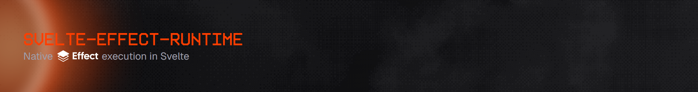

  

  <a href="https://www.npmjs.com/package/svelte-effect-runtime">npm</a>
  •
  <a href="https://jsr.io/@barekey/svelte-effect-runtime">Deno</a>
  •
  <a href="https://open-vsx.org/extension/barekey/svelte-effect-runtime-vscode">OpenVSX</a>
  •
  <a href="https://marketplace.visualstudio.com/items?itemName=Barekey.svelte-effect-runtime-vscode">Visual Studio Marketplace</a>

  Visit the <a href="https://ser.barekey.dev">docs</a> for more information.

  Runnable example apps live under <a href="./examples"><code>examples/</code></a>.

